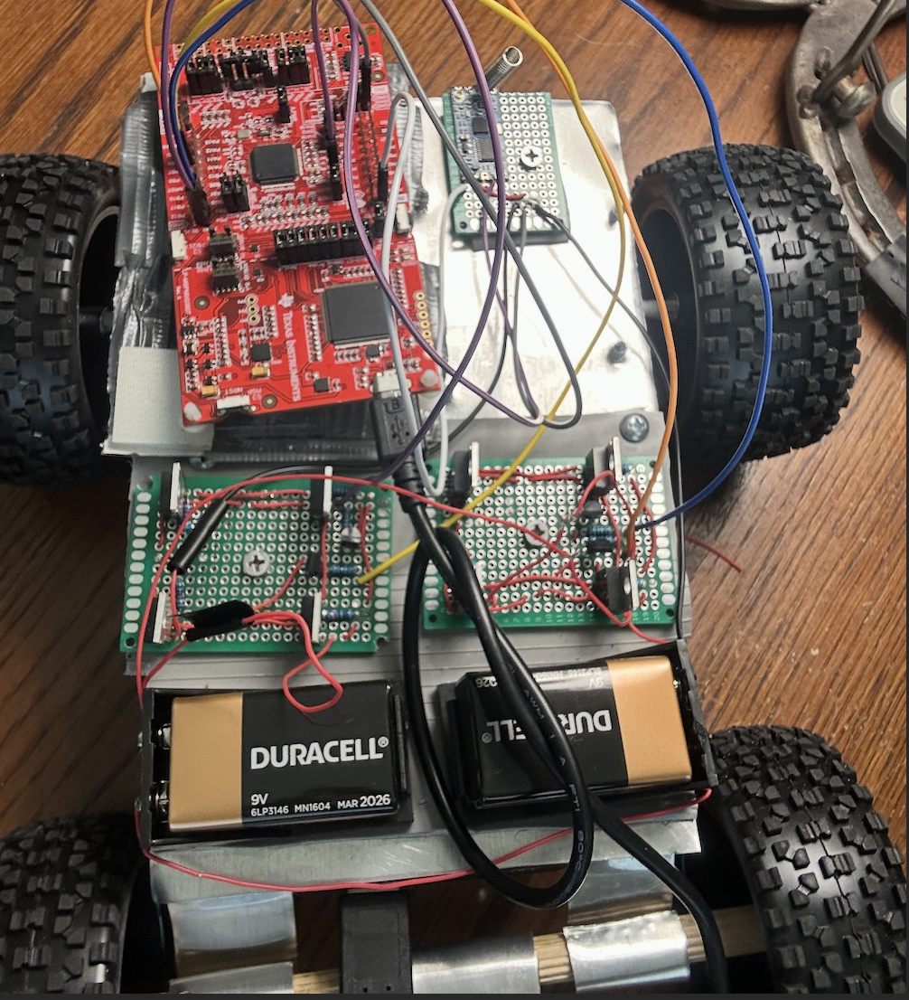
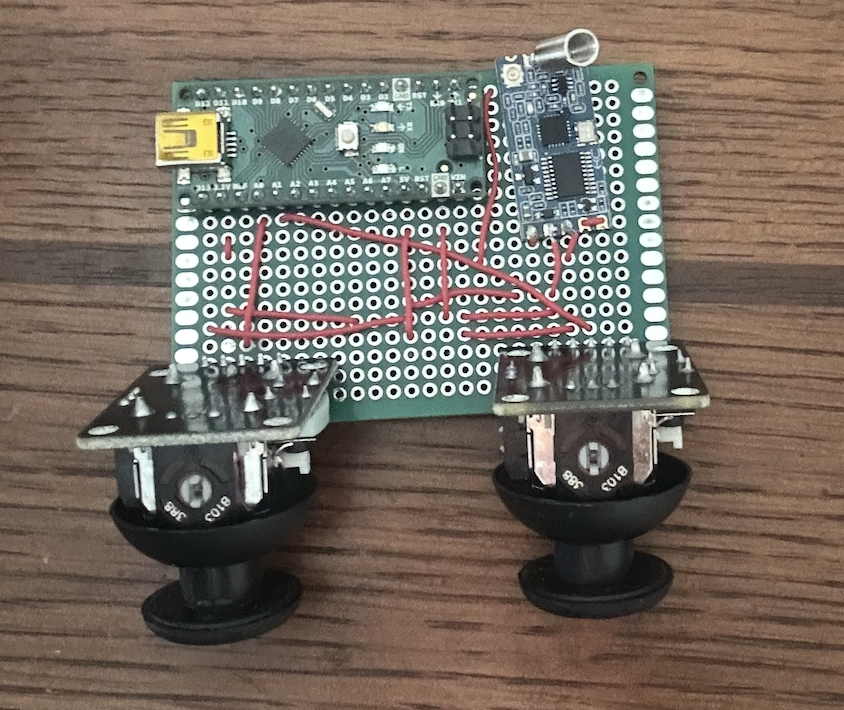
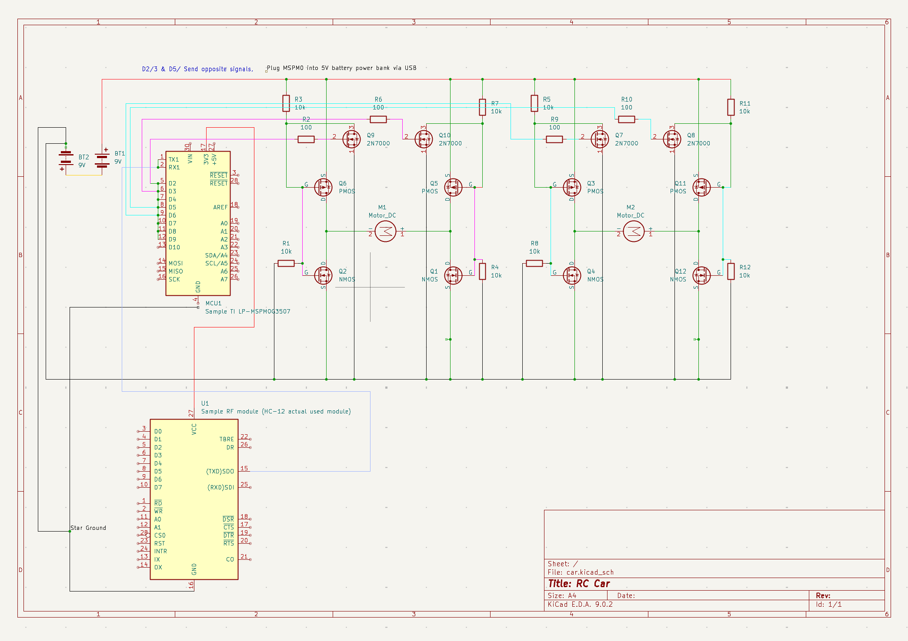
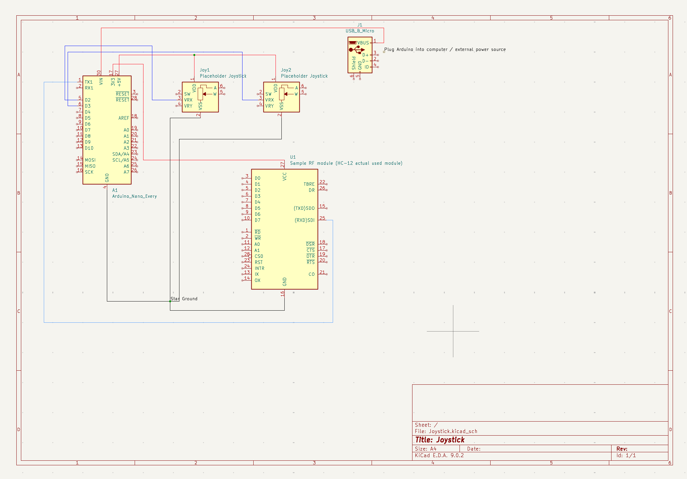

# Remote Controlled Car
- Circuit schematics were designed using Kicad. I have some substitute components on there but there should be enough information to find the real components I used
- Arduino code was not written in the IDE; it uses bare-metal C compiled with AVRDude
- TI MSPM0 code was built in Code Composer Studio with some initialization code taken from [Valvano](http://users.ece.utexas.edu/~valvano/)
- The car's MCU is intentionally desgined to be temporarily placed because I will be using it for other projects

Note: Code that I have not written has been removed from repo (basically just compilation code and clock initialization)

## Product

## Circuits

